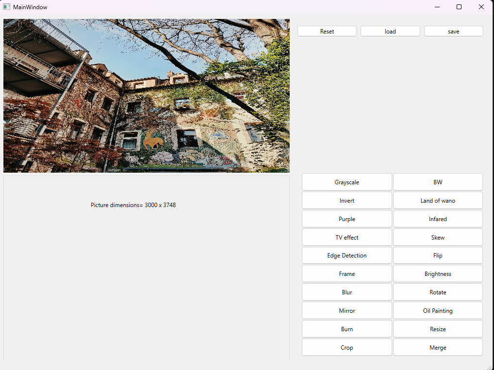

# LightEditor
A GUI program that can be used to apply various filters to your photos, currently Windows only.

# Important notes

still in its early stages,
can be used with he following image formats: "JPG, JPEG, BMP, TGA".

App is still in its early stages some filters may encounter errors.

This project was made by the supervision of Dr. Mohamed El-Ramly.
Image_class library was also made by Dr. Mohamed El-Ramly.

This app was made using Qt 6.6.0, any Qt 6 version should work fine.
This app was compiled using the MinGW65 compiler.
It is currently a windows-only application.

# How to install
In the relase you will find a folder named LightEditor, simply install it and unzip it nad run the exe.

# Preview

